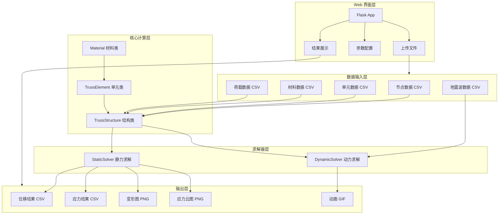
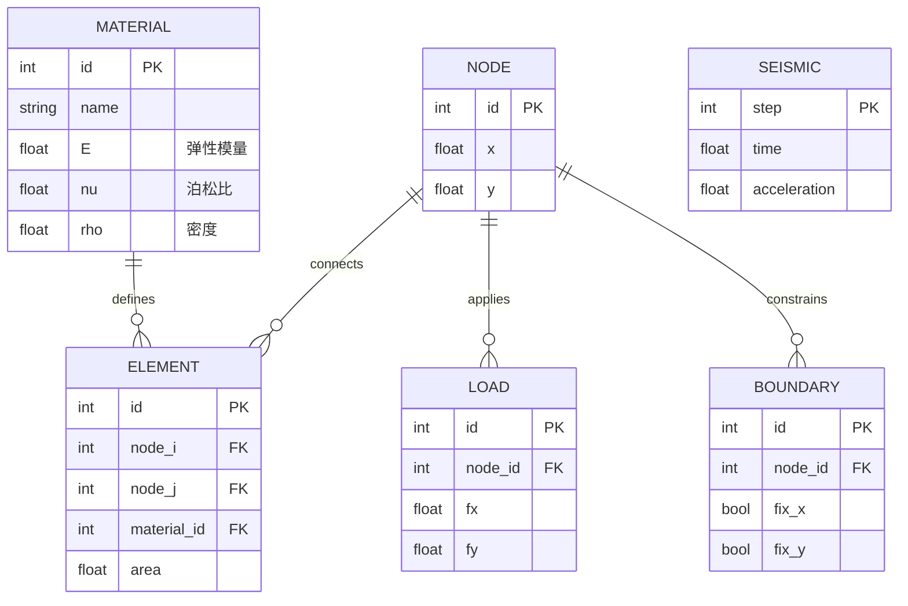

# 平面桁架结构有限元分析平台 - 设计文档

## 1. 系统架构



## 2. ER 图（数据模型）



## 3. 核心类设计

### 3.1 TrussElement 类

```python
class TrussElement:
    """平面桁架单元类"""
    
    # 属性
    id: int                    # 单元编号
    node_i: int               # 起始节点
    node_j: int               # 终止节点
    material: Material        # 材料属性
    area: float               # 截面面积
    length: float             # 单元长度
    cos_theta: float          # 方向余弦
    sin_theta: float          # 方向正弦
    
    # 方法
    def compute_stiffness_matrix() -> np.ndarray    # 4x4 局部刚度矩阵
    def compute_mass_matrix() -> np.ndarray         # 4x4 质量矩阵
    def compute_stress(displacements) -> float      # 单元应力
    def compute_strain(displacements) -> float      # 单元应变
```

### 3.2 TrussStructure 类

```python
class TrussStructure:
    """平面桁架结构类"""
    
    # 属性
    nodes: Dict[int, Node]           # 节点集合
    elements: Dict[int, TrussElement] # 单元集合
    loads: List[Load]                # 荷载集合
    boundaries: List[Boundary]       # 边界条件
    materials: Dict[int, Material]   # 材料数据库
    
    # 方法
    def add_node(id, x, y)                          # 添加节点
    def add_element(id, node_i, node_j, ...)        # 添加单元
    def apply_load(node_id, fx, fy)                 # 施加荷载
    def apply_boundary(node_id, fix_x, fix_y)       # 施加边界
    def assemble_stiffness_matrix() -> np.ndarray   # 组装整体刚度矩阵
    def assemble_mass_matrix() -> np.ndarray        # 组装整体质量矩阵
    def solve_static() -> StaticResult              # 静力求解
    def solve_dynamic(seismic_data) -> DynamicResult # 动力求解
```

## 4. 接口清单

### 4.1 数据读取接口 (io/reader.py)

| 函数 | 参数 | 返回值 | 说明 |
|------|------|--------|------|
| `read_nodes(filepath)` | CSV 文件路径 | DataFrame | 读取节点数据 |
| `read_elements(filepath)` | CSV 文件路径 | DataFrame | 读取单元数据 |
| `read_materials(filepath)` | CSV 文件路径 | DataFrame | 读取材料数据 |
| `read_loads(filepath)` | CSV 文件路径 | DataFrame | 读取荷载数据 |
| `read_seismic(filepath)` | CSV 文件路径 | DataFrame | 读取地震波数据 |

### 4.2 求解器接口 (solver/)

| 函数 | 参数 | 返回值 | 说明 |
|------|------|--------|------|
| `StaticSolver.solve(structure)` | TrussStructure | StaticResult | 静力求解 |
| `DynamicSolver.solve(structure, seismic, params)` | 结构、地震波、参数 | DynamicResult | 动力求解 |

### 4.3 可视化接口 (visualization/plotter.py)

| 函数 | 参数 | 返回值 | 说明 |
|------|------|--------|------|
| `plot_structure(structure)` | TrussStructure | Figure | 绘制原始结构 |
| `plot_deformation(structure, displacements, scale)` | 结构、位移、放大系数 | Figure | 绘制变形图 |
| `plot_stress_contour(structure, stresses)` | 结构、应力 | Figure | 绘制应力云图 |
| `create_animation(structure, time_history)` | 结构、时程数据 | Animation | 创建动画 |

### 4.4 Web 接口 (web/app.py)

| 路由 | 方法 | 说明 |
|------|------|------|
| `/` | GET | 首页 |
| `/upload` | POST | 上传数据文件 |
| `/analyze/static` | POST | 执行静力分析 |
| `/analyze/dynamic` | POST | 执行动力分析 |
| `/results/<type>` | GET | 获取分析结果 |
| `/download/<filename>` | GET | 下载结果文件 |

## 5. UI/UX 规范

### 5.1 配色方案

| 用途 | 颜色 | HEX |
|------|------|-----|
| 主色调 | 深蓝 | #1a365d |
| 辅助色 | 浅蓝 | #3182ce |
| 成功 | 绿色 | #38a169 |
| 警告 | 橙色 | #dd6b20 |
| 错误 | 红色 | #e53e3e |
| 背景 | 浅灰 | #f7fafc |
| 卡片背景 | 白色 | #ffffff |

### 5.2 字体规范

- 标题：`font-family: 'Segoe UI', sans-serif; font-weight: 600`
- 正文：`font-family: 'Segoe UI', sans-serif; font-weight: 400`
- 代码：`font-family: 'Consolas', monospace`

### 5.3 间距规范

- 基础单位：8px
- 卡片内边距：24px
- 元素间距：16px
- 圆角：8px
- 阴影：`0 2px 8px rgba(0,0,0,0.1)`

## 6. 算法说明

### 6.1 理论基础

本平台采用轴向拉压杆单元（Bar/Truss Element）理论进行桁架结构分析。

**关于 CST 理论与桁架单元的关系：**
- CST（Constant Strain Triangle）是一种平面应力/应变三角形单元，用于2D连续体分析
- 对于桁架结构，CST 理论简化为轴向拉压杆单元理论
- 桁架单元是 CST 单元的一维退化形式，仅承受轴向力

**桁架单元的基本假设：**
1. 单元仅承受轴向力（拉力或压力）
2. 单元两端为铰接，不传递弯矩
3. 单元内应变为常数
4. 材料为线弹性

### 6.2 单元刚度矩阵

对于平面桁架单元（轴向拉压杆），局部坐标系下的刚度矩阵：

$$
k_{local} = \frac{EA}{L} \begin{bmatrix} 1 & -1 \\ -1 & 1 \end{bmatrix}
$$

转换到整体坐标系：

$$
K_e = T^T k_{local} T
$$

其中 T 为坐标变换矩阵，最终得到 4×4 整体刚度矩阵：

$$
K_e = \frac{EA}{L} \begin{bmatrix} c^2 & cs & -c^2 & -cs \\ cs & s^2 & -cs & -s^2 \\ -c^2 & -cs & c^2 & cs \\ -cs & -s^2 & cs & s^2 \end{bmatrix}
$$

其中 $c = \cos\theta$, $s = \sin\theta$, $\theta$ 为单元倾角。

### 6.2 Newmark-β 法

动力方程：$M\ddot{u} + C\dot{u} + Ku = F(t)$

Newmark-β 积分格式（$\gamma = 0.5, \beta = 0.25$）：

$$
u_{n+1} = u_n + \Delta t \dot{u}_n + \frac{\Delta t^2}{2}[(1-2\beta)\ddot{u}_n + 2\beta\ddot{u}_{n+1}]
$$

$$
\dot{u}_{n+1} = \dot{u}_n + \Delta t[(1-\gamma)\ddot{u}_n + \gamma\ddot{u}_{n+1}]
$$

### 6.3 Rayleigh 阻尼

$$
C = \alpha M + \beta K
$$

其中 $\alpha$ 和 $\beta$ 由两个目标阻尼比和频率确定。

### 6.4 CST 单元刚度矩阵

CST 单元的刚度矩阵通过以下公式计算：

$$
K_e = \int\int B^T D B \cdot t \, dA = B^T D B \cdot t \cdot A
$$

其中：
- B 为 3×6 应变-位移矩阵
- D 为 3×3 弹性矩阵（平面应力）
- t 为单元厚度
- A 为单元面积

弹性矩阵（平面应力）：

$$
D = \frac{E}{1-\nu^2} \begin{bmatrix} 1 & \nu & 0 \\ \nu & 1 & 0 \\ 0 & 0 & \frac{1-\nu}{2} \end{bmatrix}
$$

### 6.5 稀疏矩阵与迭代求解器

对于大规模问题（节点数 > 500），平台支持：

1. 稀疏矩阵存储：使用 scipy.sparse 的 CSR 格式
2. 直接求解器：scipy.sparse.linalg.spsolve
3. 迭代求解器：共轭梯度法（CG），适用于对称正定系统

性能基准（参考值）：

| 节点数 | 自由度 | 密集矩阵(s) | 稀疏矩阵(s) | 迭代求解(s) |
|--------|--------|-------------|-------------|-------------|
| 100    | 200    | 0.02        | 0.01        | 0.01        |
| 500    | 1000   | 0.5         | 0.05        | 0.03        |
| 1000   | 2000   | 4.0         | 0.15        | 0.08        |
| 2000   | 4000   | 35.0        | 0.6         | 0.3         |
