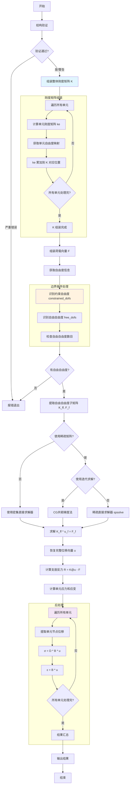

# 平面桁架结构有限元分析平台求解器实现分析

## 目录

1. [Newmark-β 法在动力分析中的实现](#1-newmark-β-法在动力分析中的实现)
2. [刚度矩阵的组装过程](#2-刚度矩阵的组装过程)
3. [边界条件的施加方式](#3-边界条件的施加方式)
4. [求解器计算流程图](#4-求解器计算流程图)
5. [数学公式与代码对应](#5-数学公式与代码对应)

---

## 1. Newmark-β 法在动力分析中的实现

### 1.1 基本原理

Newmark-β 法是一种逐步积分方法，用于求解结构动力学方程：

$$\mathbf{M} \ddot{\mathbf{u}} + \mathbf{C} \dot{\mathbf{u}} + \mathbf{K} \mathbf{u} = \mathbf{F}(t)$$

其中：
- $\mathbf{M}$：质量矩阵
- $\mathbf{C}$：阻尼矩阵
- $\mathbf{K}$：刚度矩阵
- $\mathbf{F}(t)$：随时间变化的荷载向量

### 1.2 算法假设

Newmark 法基于以下位移和速度的假设：

$$\dot{\mathbf{u}}_{n+1} = \dot{\mathbf{u}}_n + \left[(1-\gamma)\ddot{\mathbf{u}}_n + \gamma\ddot{\mathbf{u}}_{n+1}\right]\Delta t$$

$$\mathbf{u}_{n+1} = \mathbf{u}_n + \dot{\mathbf{u}}_n\Delta t + \left[\left(\frac{1}{2}-\beta\right)\ddot{\mathbf{u}}_n + \beta\ddot{\mathbf{u}}_{n+1}\right]\Delta t^2$$

**代码位置：** `fem_truss/solver/dynamic.py:29-31`

默认参数（平均加速度法，无条件稳定）：
- $\gamma = 0.5$
- $\beta = 0.25$

### 1.3 实现步骤

#### 步骤 1: 参数设置与初始化

- 设置 Newmark 参数
- 设置 Rayleigh 阻尼参数
- 组装系统矩阵（K, M, C）

**代码位置：** `fem_truss/solver/dynamic.py:37-115`

#### 步骤 2: 计算积分系数

```python
a0 = 1 / (self.beta * dt**2)
a1 = self.gamma / (self.beta * dt)
a2 = 1 / (self.beta * dt)
a3 = 1 / (2 * self.beta) - 1
a4 = self.gamma / self.beta - 1
a5 = dt * (self.gamma / (2 * self.beta) - 1)
a6 = dt * (1 - self.gamma)
a7 = self.gamma * dt
```

**代码位置：** `fem_truss/solver/dynamic.py:183-191`

#### 步骤 3: 构建有效刚度矩阵

$$\mathbf{K}_{eff} = \mathbf{K} + a_0 \mathbf{M} + a_1 \mathbf{C}$$

**代码位置：** `fem_truss/solver/dynamic.py:194`

#### 步骤 4: 时间积分循环

对于每个时间步：

1. **计算有效荷载向量：**
   $$\mathbf{F}_{eff} = \mathbf{F}_{eq} + \mathbf{M}(a_0 \mathbf{u}_n + a_2 \dot{\mathbf{u}}_n + a_3 \ddot{\mathbf{u}}_n) + \mathbf{C}(a_1 \mathbf{u}_n + a_4 \dot{\mathbf{u}}_n + a_5 \ddot{\mathbf{u}}_n)$$

   **代码位置：** `fem_truss/solver/dynamic.py:203-204`

2. **求解位移增量：**
   $$\mathbf{u}_{n+1} = \mathbf{K}_{eff}^{-1} \mathbf{F}_{eff}$$

   **代码位置：** `fem_truss/solver/dynamic.py:207`

3. **更新加速度和速度：**
   $$\ddot{\mathbf{u}}_{n+1} = a_0(\mathbf{u}_{n+1} - \mathbf{u}_n) - a_2 \dot{\mathbf{u}}_n - a_3 \ddot{\mathbf{u}}_n$$
   $$\dot{\mathbf{u}}_{n+1} = \dot{\mathbf{u}}_n + a_6 \ddot{\mathbf{u}}_n + a_7 \ddot{\mathbf{u}}_{n+1}$$

   **代码位置：** `fem_truss/solver/dynamic.py:210-211`

### 1.4 Rayleigh 阻尼

$$\mathbf{C} = \alpha \mathbf{M} + \beta_d \mathbf{K}$$

其中系数通过指定两阶模态阻尼比求解：

$$\xi_i = \frac{\alpha}{2\omega_i} + \frac{\beta_d \omega_i}{2}$$

**代码位置：** `fem_truss/solver/dynamic.py:49-100`

---

## 2. 刚度矩阵的组装过程

### 2.1 桁架单元刚度矩阵

#### 局部坐标系刚度矩阵：

$$\mathbf{k}_{local} = \frac{EA}{L} \begin{bmatrix} 1 & -1 \\ -1 & 1 \end{bmatrix}$$

#### 坐标变换到整体坐标系：

$$\mathbf{K} = \mathbf{T}^T \mathbf{k}_{local} \mathbf{T}$$

其中变换矩阵：

$$\mathbf{T} = \begin{bmatrix} c & s & 0 & 0 \\ 0 & 0 & c & s \end{bmatrix}$$

#### 最终整体坐标系刚度矩阵：

$$\mathbf{K}_e = \frac{EA}{L} \begin{bmatrix}
c^2 & cs & -c^2 & -cs \\
cs & s^2 & -cs & -s^2 \\
-c^2 & -cs & c^2 & cs \\
-cs & -s^2 & cs & s^2
\end{bmatrix}$$

**代码位置：** `fem_truss/core/element.py:168-220`

### 2.2 CST 单元刚度矩阵

#### 应变-位移矩阵 B (3×6):

$$\mathbf{B} = \frac{1}{2A} \begin{bmatrix}
b_1 & 0 & b_2 & 0 & b_3 & 0 \\
0 & c_1 & 0 & c_2 & 0 & c_3 \\
c_1 & b_1 & c_2 & b_2 & c_3 & b_3
\end{bmatrix}$$

其中：
- $b_i = y_j - y_k$
- $c_i = x_k - x_j$

**代码位置：** `fem_truss/core/cst_element.py:105-138`

#### 弹性矩阵 D (3×3):

$$\mathbf{D} = \frac{E}{1-\nu^2} \begin{bmatrix}
1 & \nu & 0 \\
\nu & 1 & 0 \\
0 & 0 & \frac{1-\nu}{2}
\end{bmatrix}$$

**代码位置：** `fem_truss/core/cst_element.py:140-157`

#### 单元刚度矩阵:

$$\mathbf{K}_e = \mathbf{B}^T \mathbf{D} \mathbf{B} \cdot t \cdot A$$

**代码位置：** `fem_truss/core/cst_element.py:177-192`

### 2.3 整体刚度矩阵组装流程

1. **初始化**：创建 ndof × ndof 的零矩阵
   - 密集矩阵：使用 `numpy.zeros()`
   - 稀疏矩阵：使用 `scipy.sparse.lil_matrix()`

   **代码位置：** `fem_truss/core/structure.py:337, 364`

2. **自由度映射**：获取单元节点对应的整体自由度索引

   **代码位置：** `fem_truss/core/structure.py:307-320`

3. **单元循环**：遍历所有单元，计算单元刚度矩阵

4. **矩阵组装**：将单元刚度矩阵的元素累加到整体刚度矩阵的对应位置

   ```python
   for i, gi in enumerate(dof_indices):
       for j, gj in enumerate(dof_indices):
           K[gi, gj] += ke[i, j]
   ```

   **代码位置：** `fem_truss/core/structure.py:344-346`

5. **支持的单元类型**：
   - 桁架杆单元 (TrussElement)
   - CST 平面应力三角形单元 (CSTElement)

   **代码位置：** `fem_truss/core/structure.py:340-355`

---

## 3. 边界条件的施加方式

### 3.1 边界条件定义

每个节点可以独立约束 X 和/或 Y 方向的位移：

```python
@dataclass
class Boundary:
    id: int
    node_id: int
    fix_x: bool = False  # X方向约束
    fix_y: bool = False  # Y方向约束
```

**代码位置：** `fem_truss/core/structure.py:43-52`

### 3.2 施加方法 - 自由度缩聚法

系统采用**自由度缩聚法**（或称"划行划列法"）施加边界条件，这是有限元分析中标准且高效的方法。

#### 步骤 1: 自由度分类

将系统自由度分为两类：

- **自由自由度** (free_dofs)：未被约束的自由度
- **约束自由度** (constrained_dofs)：被支座约束的自由度

**代码位置：** `fem_truss/core/structure.py:468-484`

#### 步骤 2: 系统矩阵分块

将刚度矩阵和荷载向量按自由度分块：

$$\begin{bmatrix}
\mathbf{K}_{ff} & \mathbf{K}_{fc} \\
\mathbf{K}_{cf} & \mathbf{K}_{cc}
\end{bmatrix}
\begin{bmatrix}
\mathbf{u}_f \\
\mathbf{u}_c
\end{bmatrix} =
\begin{bmatrix}
\mathbf{F}_f \\
\mathbf{F}_c + \mathbf{R}
\end{bmatrix}$$

其中：
- $\mathbf{u}_c = 0$（支座位移为零）
- $\mathbf{R}$：支座反力

#### 步骤 3: 求解降阶系统

由于 $\mathbf{u}_c = 0$，系统简化为：

$$\mathbf{K}_{ff} \mathbf{u}_f = \mathbf{F}_f$$

**代码位置：** `fem_truss/solver/static.py:86-90`

提取子矩阵：
```python
K_ff = self._K[np.ix_(free_dofs, free_dofs)]
F_f = self._F[free_dofs]
```

#### 步骤 4: 求解位移并恢复

1. 求解自由自由度位移：$\mathbf{u}_f = \mathbf{K}_{ff}^{-1} \mathbf{F}_f$
2. 恢复完整位移向量：$\mathbf{u} = [\mathbf{u}_f, \mathbf{0}]^T$

**代码位置：** `fem_truss/solver/static.py:101-123`

#### 步骤 5: 计算支座反力

$$\mathbf{R} = \mathbf{K} \mathbf{u} - \mathbf{F}$$

**代码位置：** `fem_truss/solver/static.py:128-131`

### 3.3 边界条件验证

结构验证时检查约束自由度数量：
- 至少需要约束 3 个自由度以防止刚体运动
- 不能约束所有自由度

**代码位置：** `fem_truss/core/structure.py:504-506`

---

## 4. 求解器计算流程图



---

## 5. 数学公式与代码对应

| 序号 | 数学公式 | 代码位置 | 说明 |
|------|---------|----------|------|
| 1 | $\mathbf{K}_e = \frac{EA}{L}\mathbf{T}^T\begin{bmatrix}1&-1\\-1&1\end{bmatrix}\mathbf{T}$ | `fem_truss/core/element.py:212-217` | 桁架单元刚度矩阵 |
| 2 | $\mathbf{B} = \frac{1}{2A}\begin{bmatrix}b_1&0&b_2&0&b_3&0\\0&c_1&0&c_2&0&c_3\\c_1&b_1&c_2&b_2&c_3&b_3\end{bmatrix}$ | `fem_truss/core/cst_element.py:134-138` | CST单元应变-位移矩阵 |
| 3 | $\mathbf{D} = \frac{E}{1-\nu^2}\begin{bmatrix}1&\nu&0\\\nu&1&0\\0&0&\frac{1-\nu}{2}\end{bmatrix}$ | `fem_truss/core/cst_element.py:153-157` | 平面应力弹性矩阵 |
| 4 | $\mathbf{K}_e = \mathbf{B}^T\mathbf{D}\mathbf{B}\cdot t\cdot A$ | `fem_truss/core/cst_element.py:189` | CST单元刚度矩阵 |
| 5 | $K_{ij} += ke_{mn}$ | `fem_truss/core/structure.py:345-346` | 整体刚度矩阵组装 |
| 6 | $\mathbf{M}\ddot{\mathbf{u}} + \mathbf{C}\dot{\mathbf{u}} + \mathbf{K}\mathbf{u} = \mathbf{F}(t)$ | `fem_truss/solver/dynamic.py:117` | 动力学方程 |
| 7 | $\dot{\mathbf{u}}_{n+1} = \dot{\mathbf{u}}_n + [(1-\gamma)\ddot{\mathbf{u}}_n + \gamma\ddot{\mathbf{u}}_{n+1}]\Delta t$ | `fem_truss/solver/dynamic.py:211` | Newmark速度更新 |
| 8 | $\mathbf{u}_{n+1} = \mathbf{u}_n + \dot{\mathbf{u}}_n\Delta t + \left[\left(\frac{1}{2}-\beta\right)\ddot{\mathbf{u}}_n + \beta\ddot{\mathbf{u}}_{n+1}\right]\Delta t^2$ | `fem_truss/solver/dynamic.py:210` | Newmark位移更新 |
| 9 | $\mathbf{K}_{eff} = \mathbf{K} + a_0\mathbf{M} + a_1\mathbf{C}$ | `fem_truss/solver/dynamic.py:194` | 有效刚度矩阵 |
| 10 | $\mathbf{C} = \alpha\mathbf{M} + \beta_d\mathbf{K}$ | `fem_truss/solver/dynamic.py:113` | Rayleigh阻尼矩阵 |
| 11 | $\mathbf{K}_{ff}\mathbf{u}_f = \mathbf{F}_f$ | `fem_truss/solver/static.py:116` | 边界条件处理后求解 |
| 12 | $\mathbf{R} = \mathbf{K}\mathbf{u} - \mathbf{F}$ | `fem_truss/solver/static.py:131` | 支座反力计算 |
| 13 | $\sigma = \mathbf{D}\mathbf{B}\mathbf{u}$ | `fem_truss/core/element.py:286` | 单元应力计算 |
| 14 | $\varepsilon = \mathbf{B}\mathbf{u}$ | `fem_truss/core/element.py:282` | 单元应变计算 |
| 15 | $U = \frac{1}{2}\mathbf{u}^T\mathbf{K}\mathbf{u}$ | `fem_truss/solver/static.py:185` | 应变能计算 |
| 16 | $\mathbf{K}\Phi = \omega^2\mathbf{M}\Phi$ | `fem_truss/solver/static.py:212` | 特征值问题（模态分析） |

---

## 总结

本平台的求解器实现具有以下特点：

1. **Newmark-β 法**：采用平均加速度法（γ=0.5, β=0.25），无条件稳定，适用于各种动力分析
2. **刚度矩阵组装**：支持桁架单元和 CST 单元，提供密集和稀疏两种存储模式
3. **边界条件**：采用自由度缩聚法，数值稳定且实现简单
4. **求解方法**：支持直接求解和迭代求解（CG），可适应不同规模的问题
