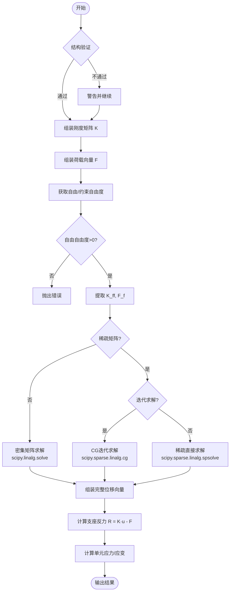
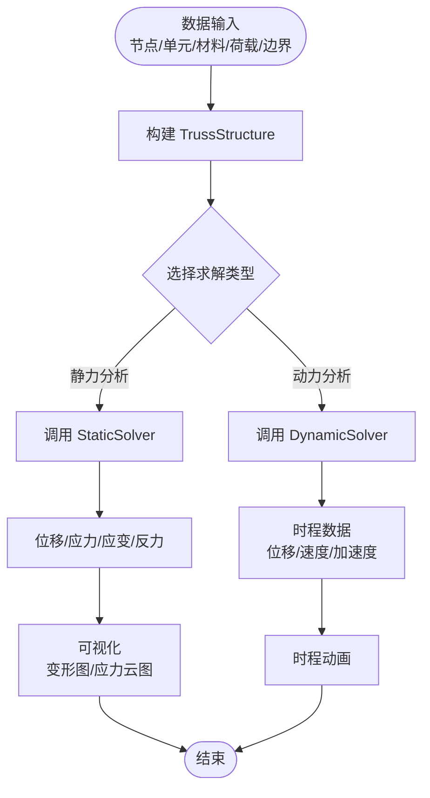

# 平面桁架结构有限元分析平台 - 求解器实现分析

## 目录

1. [Newmark-β 法在动力分析中的实现](#1-newmark-β-法在动力分析中的实现)
2. [刚度矩阵的组装过程](#2-刚度矩阵的组装过程)
3. [边界条件的施加](#3-边界条件的施加)
4. [求解器计算流程图](#4-求解器计算流程图)
5. [数学公式与代码对应位置汇总](#5-数学公式与代码对应位置汇总)

---

## 1. Newmark-β 法在动力分析中的实现

### 1.1 理论基础

动力方程（二阶常微分方程组）：

$$
M \ddot{u} + C \dot{u} + K u = F(t)
$$

其中：
- $M$ - 质量矩阵
- $C$ - 阻尼矩阵
- $K$ - 刚度矩阵
- $u, \dot{u}, \ddot{u}$ - 位移、速度、加速度向量
- $F(t)$ - 荷载向量（时变）

### 1.2 Newmark-β 积分格式

Newmark-β 法的核心假设（对加速度在时间步长内的变化模式）：

$$
u_{n+1} = u_n + \Delta t \dot{u}_n + \frac{\Delta t^2}{2} \left[(1 - 2\beta) \ddot{u}_n + 2\beta \ddot{u}_{n+1}\right]
$$

$$
\dot{u}_{n+1} = \dot{u}_n + \Delta t \left[(1 - \gamma) \ddot{u}_n + \gamma \ddot{u}_{n+1}\right]
$$

**参数选择：**
- $\gamma = 0.5$, $\beta = 0.25$ - 平均加速度法（无条件稳定，推荐使用）
- 代码位置：`fem_truss/solver/dynamic.py:29-31`

### 1.3 实现步骤

#### 步骤 1：初始化参数和矩阵

```python
# Newmark-β 参数
self.gamma = 0.5
self.beta = 0.25

# 组装整体矩阵
K = self.structure.assemble_stiffness_matrix()  # 刚度矩阵
M = self.structure.assemble_mass_matrix()       # 质量矩阵
C = self.build_damping_matrix(M, K)             # 阻尼矩阵
```
- 代码位置：`fem_truss/solver/dynamic.py:29-31, 143-145`

#### 步骤 2：构建 Rayleigh 阻尼矩阵

$$
C = \alpha M + \beta_d K
$$

其中 $\alpha$ 和 $\beta_d$ 由目标阻尼比和频率确定：

$$
\xi_i = \frac{\alpha}{2 \omega_i} + \frac{\beta_d \omega_i}{2}
$$

```python
def build_damping_matrix(self, M: np.ndarray, K: np.ndarray) -> np.ndarray:
    C = self.alpha * M + self.beta_damping * K
    return C
```
- 数学公式：`fem_truss/solver/dynamic.py:61-62`
- 代码位置：`fem_truss/solver/dynamic.py:102-115`

#### 步骤 3：计算 Newmark 积分系数

$$
\begin{cases}
a_0 = \frac{1}{\beta \Delta t^2} \\
a_1 = \frac{\gamma}{\beta \Delta t} \\
a_2 = \frac{1}{\beta \Delta t} \\
a_3 = \frac{1}{2\beta} - 1 \\
a_4 = \frac{\gamma}{\beta} - 1 \\
a_5 = \Delta t \left( \frac{\gamma}{2\beta} - 1 \right) \\
a_6 = \Delta t (1 - \gamma) \\
a_7 = \gamma \Delta t
\end{cases}
$$

```python
a0 = 1 / (self.beta * dt**2)
a1 = self.gamma / (self.beta * dt)
a2 = 1 / (self.beta * dt)
a3 = 1 / (2 * self.beta) - 1
a4 = self.gamma / self.beta - 1
a5 = dt * (self.gamma / (2 * self.beta) - 1)
a6 = dt * (1 - self.gamma)
a7 = self.gamma * dt
```
- 代码位置：`fem_truss/solver/dynamic.py:183-191`

#### 步骤 4：构建有效刚度矩阵

$$
K_{eff} = K_{ff} + a_0 M_{ff} + a_1 C_{ff}
$$

```python
K_eff = K_ff + a0 * M_ff + a1 * C_ff
```
- 代码位置：`fem_truss/solver/dynamic.py:194`

#### 步骤 5：时间步进求解

在每个时间步 $i$：

**5.1 计算有效荷载：**

$$
F_{eff} = F_{eq} + M_{ff} \left( a_0 u_i + a_2 \dot{u}_i + a_3 \ddot{u}_i \right) + C_{ff} \left( a_1 u_i + a_4 \dot{u}_i + a_5 \ddot{u}_i \right)
$$

**5.2 求解位移：**

$$
K_{eff} u_{i+1} = F_{eff}
$$

**5.3 更新速度和加速度：**

$$
\ddot{u}_{i+1} = a_0 (u_{i+1} - u_i) - a_2 \dot{u}_i - a_3 \ddot{u}_i
$$

$$
\dot{u}_{i+1} = \dot{u}_i + a_6 \ddot{u}_i + a_7 \ddot{u}_{i+1}
$$

```python
for i in range(1, n_steps):
    # 地震荷载
    F_eq = -M_ff @ influence_vector * acceleration[i]
    
    # 有效荷载
    F_eff = F_eq + M_ff @ (a0 * u + a2 * v + a3 * a) + \
            C_ff @ (a1 * u + a4 * v + a5 * a)
    
    # 求解位移增量
    u_new = solve(K_eff, F_eff)
    
    # 更新速度和加速度
    a_new = a0 * (u_new - u) - a2 * v - a3 * a
    v_new = v + a6 * a + a7 * a_new
    
    # 更新状态
    u, v, a = u_new, v_new, a_new
```
- 代码位置：`fem_truss/solver/dynamic.py:198-214`

### 1.4 地震荷载输入

地震荷载通过惯性力施加：

$$
F = -M \cdot I \cdot a_g
$$

其中 $I$ 为影响向量（指定地震作用方向）。

```python
influence_vector = np.zeros(n_free)
for i, dof in enumerate(free_dofs):
    if direction == 'x' and dof % 2 == 0:
        influence_vector[i] = 1.0
    elif direction == 'y' and dof % 2 == 1:
        influence_vector[i] = 1.0

F_eq = -M_ff @ influence_vector * acceleration[i]
```
- 代码位置：`fem_truss/solver/dynamic.py:158-164, 200`

---

## 2. 刚度矩阵的组装过程

### 2.1 桁架单元刚度矩阵

#### 2.1.1 局部坐标系下的单元刚度矩阵

对于轴向拉压杆单元，局部坐标系（x'轴沿杆件方向）下的刚度矩阵：

$$
k_{local} = \frac{EA}{L} \begin{bmatrix} 1 & -1 \\ -1 & 1 \end{bmatrix}
$$

其中：
- $E$ - 弹性模量
- $A$ - 截面面积
- $L$ - 单元长度

#### 2.1.2 坐标变换矩阵

变换矩阵 $T$ 将局部坐标系下的量转换到整体坐标系：

$$
T = \begin{bmatrix}
c & s & 0 & 0 \\
0 & 0 & c & s
\end{bmatrix}
$$

其中 $c = \cos\theta$, $s = \sin\theta$, $\theta$ 为单元与 x 轴的夹角。

#### 2.1.3 整体坐标系下的单元刚度矩阵

$$
K_e = T^T k_{local} T
$$

展开后得到 4×4 矩阵：

$$
K_e = \frac{EA}{L} \begin{bmatrix}
c^2 & cs & -c^2 & -cs \\
cs & s^2 & -cs & -s^2 \\
-c^2 & -cs & c^2 & cs \\
-cs & -s^2 & cs & s^2
\end{bmatrix}
$$

```python
def compute_stiffness_matrix(self) -> np.ndarray:
    c = self._cos_theta
    s = self._sin_theta
    E = self.material.E
    A = self.area
    L = self._length
    
    k = E * A / L
    cc = c * c
    ss = s * s
    cs = c * s
    
    ke = k * np.array([
        [ cc,  cs, -cc, -cs],
        [ cs,  ss, -cs, -ss],
        [-cc, -cs,  cc,  cs],
        [-cs, -ss,  cs,  ss]
    ])
    return ke
```
- 数学公式：`fem_truss/core/element.py:174-188`
- 代码位置：`fem_truss/core/element.py:168-220`

### 2.2 整体刚度矩阵的组装

采用"直接刚度法"组装整体刚度矩阵：

$$
K_{global}[gi, gj] += K_e[i, j]
$$

其中 $gi, gj$ 为整体自由度索引，$i, j$ 为单元局部自由度索引。

```python
def assemble_stiffness_matrix(self) -> np.ndarray:
    K = np.zeros((self._ndof, self._ndof))
    
    # 组装桁架单元
    for elem in self.elements.values():
        ke = elem.compute_stiffness_matrix()
        dof_indices = self.get_element_dof_indices(elem)
        
        for i, gi in enumerate(dof_indices):
            for j, gj in enumerate(dof_indices):
                K[gi, gj] += ke[i, j]
    
    # 组装 CST 单元（同理）
    for elem in self.cst_elements.values():
        ke = elem.compute_stiffness_matrix()
        dof_indices = self.get_element_dof_indices(elem)
        
        for i, gi in enumerate(dof_indices):
            for j, gj in enumerate(dof_indices):
                K[gi, gj] += ke[i, j]
    
    return K
```
- 代码位置：`fem_truss/core/structure.py:322-358`

### 2.3 自由度映射

每个节点有 2 个自由度（x, y），自由度索引按节点顺序分配：

```python
def _update_dof_map(self):
    self._dof_map.clear()
    sorted_nodes = sorted(self.nodes.keys())
    
    for i, node_id in enumerate(sorted_nodes):
        self._dof_map[node_id] = (2 * i, 2 * i + 1)
    
    self._ndof = 2 * len(self.nodes)
```
- 代码位置：`fem_truss/core/structure.py:266-274`

---

## 3. 边界条件的施加

### 3.1 边界条件分类

- **固定约束** - 位移为零（$u = 0, v = 0$）
- **单向约束** - 仅约束某一方向（如滚轴支座）

### 3.2 施加方法：消去法（Condensation）

#### 3.2.1 矩阵分块

将整体系统按自由自由度（$f$）和约束自由度（$c$）分块：

$$
\begin{bmatrix}
K_{ff} & K_{fc} \\
K_{cf} & K_{cc}
\end{bmatrix}
\begin{bmatrix}
u_f \\
u_c
\end{bmatrix}
=
\begin{bmatrix}
F_f \\
F_c
\end{bmatrix}
$$

#### 3.2.2 提取自由自由度子系统

由于约束位移 $u_c = 0$，方程简化为：

$$
K_{ff} u_f = F_f
$$

#### 3.2.3 求解后计算支座反力

$$
F_c = K_{cf} u_f + K_{cc} u_c - F_c^{applied} = K_{cf} u_f - F_c^{applied}
$$

或更简单的方式：

$$
R = K_{global} u - F
$$

### 3.3 代码实现

```python
# 步骤 1：获取自由和约束自由度
free_dofs = self.structure.get_free_dofs()
constrained_dofs = self.structure.get_constrained_dofs()

# 步骤 2：提取自由自由度子矩阵
K_ff = K[np.ix_(free_dofs, free_dofs)]
F_f = F[free_dofs]

# 步骤 3：求解位移
u_f = solve(K_ff, F_f)

# 步骤 4：组装完整位移向量
displacements = np.zeros(self.structure.ndof)
displacements[free_dofs] = u_f

# 步骤 5：计算支座反力
reactions = self._K @ displacements - self._F
```
- 代码位置：`fem_truss/solver/static.py:76-131`

### 3.4 约束自由度的获取

```python
def get_constrained_dofs(self) -> List[int]:
    constrained = []
    
    for bc in self.boundaries:
        dof_x, dof_y = self._dof_map[bc.node_id]
        if bc.fix_x:
            constrained.append(dof_x)
        if bc.fix_y:
            constrained.append(dof_y)
    
    return sorted(set(constrained))

def get_free_dofs(self) -> List[int]:
    constrained = set(self.get_constrained_dofs())
    return [i for i in range(self._ndof) if i not in constrained]
```
- 代码位置：`fem_truss/core/structure.py:468-484`

---

## 4. 求解器计算流程图

### 4.1 静力求解器流程



### 4.2 动力求解器（Newmark-β法）流程

```mermaid
flowchart TD
    Start([开始]) --> SetParams[设置 Newmark 参数<br/>γ=0.5, β=0.25]
    SetParams --> SetDamping[设置 Rayleigh 阻尼]
    
    SetDamping --> AssembleMatrices[组装 K, M, C]
    AssembleMatrices --> GetFreeDOFs[提取自由自由度子矩阵<br/>K_ff, M_ff, C_ff]
    
    GetFreeDOFs --> BuildInfluence[构建地震影响向量 I]
    BuildInfluence --> InitState[初始化 u₀, v₀, a₀]
    InitState --> ComputeCoeffs[计算 Newmark 系数 a₀~a₇]
    ComputeCoeffs --> BuildKeff[构建有效刚度 K_eff]
    
    BuildKeff --> TimeLoop{时间步循环<br/>i = 1..n_steps}
    TimeLoop -->|是| ComputeFeq[计算等效地震荷载<br/>F_eq = -M_ff·I·a_g(i)]
    ComputeFeq --> ComputeFeff[计算有效荷载 F_eff]
    
    ComputeFeff --> SolveU[求解位移 u_new = K_eff⁻¹·F_eff]
    SolveU --> UpdateA[更新加速度 a_new]
    UpdateA --> UpdateV[更新速度 v_new]
    UpdateV --> UpdateState[更新状态 u,v,a ← u_new,v_new,a_new]
    UpdateState --> SaveResult[保存位移/速度/加速度时程]
    
    SaveResult --> TimeLoop
    TimeLoop -->|否| Output([输出时程结果])
```

### 4.3 完整求解器主流程



---

## 5. 数学公式与代码对应位置汇总

| 序号 | 数学公式 | 描述 | 文件:行号 |
|------|---------|------|----------|
| 1 | $k_{local} = \frac{EA}{L} \begin{bmatrix} 1 & -1 \\ -1 & 1 \end{bmatrix}$ | 局部坐标系单元刚度矩阵 | `fem_truss/core/element.py:174-175` |
| 2 | $K_e = T^T k_{local} T$ | 坐标变换 | `fem_truss/core/element.py:177-178` |
| 3 | $K_e = \frac{EA}{L} \begin{bmatrix} c^2 & cs & -c^2 & -cs \\ \vdots & \vdots & \vdots & \vdots \\ -cs & -s^2 & cs & s^2 \end{bmatrix}$ | 整体坐标系单元刚度矩阵 | `fem_truss/core/element.py:212-217` |
| 4 | $K_{global}[gi, gj] += K_e[i, j]$ | 整体刚度矩阵组装 | `fem_truss/core/structure.py:344-346` |
| 5 | $K_{ff} u_f = F_f$ | 约束消去后的方程 | `fem_truss/solver/static.py:116` |
| 6 | $R = K_{global} u - F$ | 支座反力计算 | `fem_truss/solver/static.py:129-131` |
| 7 | $M \ddot{u} + C \dot{u} + K u = F(t)$ | 动力方程 | `fem_truss/solver/dynamic.py:16-18` |
| 8 | $u_{n+1} = u_n + \Delta t \dot{u}_n + \frac{\Delta t^2}{2} \left[(1 - 2\beta) \ddot{u}_n + 2\beta \ddot{u}_{n+1}\right]$ | Newmark 位移公式 | `fem_truss/solver/dynamic.py:266-268` (文档) |
| 9 | $\dot{u}_{n+1} = \dot{u}_n + \Delta t \left[(1 - \gamma) \ddot{u}_n + \gamma \ddot{u}_{n+1}\right]$ | Newmark 速度公式 | `fem_truss/solver/dynamic.py:270-272` (文档) |
| 10 | $C = \alpha M + \beta_d K$ | Rayleigh 阻尼 | `fem_truss/solver/dynamic.py:61, 113` |
| 11 | $\xi_i = \frac{\alpha}{2 \omega_i} + \frac{\beta_d \omega_i}{2}$ | 阻尼比公式 | `fem_truss/solver/dynamic.py:62` |
| 12 | $a_0 = \frac{1}{\beta \Delta t^2}, a_1 = \frac{\gamma}{\beta \Delta t}, \dots$ | Newmark 积分系数 | `fem_truss/solver/dynamic.py:183-191` |
| 13 | $K_{eff} = K_{ff} + a_0 M_{ff} + a_1 C_{ff}$ | 有效刚度矩阵 | `fem_truss/solver/dynamic.py:194` |
| 14 | $F_{eff} = F_{eq} + M_{ff} (a_0 u_i + a_2 \dot{u}_i + a_3 \ddot{u}_i) + C_{ff} (a_1 u_i + a_4 \dot{u}_i + a_5 \ddot{u}_i)$ | 有效荷载 | `fem_truss/solver/dynamic.py:203-204` |
| 15 | $K_{eff} u_{i+1} = F_{eff}$ | 每步求解方程 | `fem_truss/solver/dynamic.py:207` |
| 16 | $\ddot{u}_{i+1} = a_0 (u_{i+1} - u_i) - a_2 \dot{u}_i - a_3 \ddot{u}_i$ | 加速度更新 | `fem_truss/solver/dynamic.py:210` |
| 17 | $\dot{u}_{i+1} = \dot{u}_i + a_6 \ddot{u}_i + a_7 \ddot{u}_{i+1}$ | 速度更新 | `fem_truss/solver/dynamic.py:211` |
| 18 | $F = -M \cdot I \cdot a_g$ | 地震惯性力 | `fem_truss/solver/dynamic.py:158, 200` |
| 19 | $\varepsilon = B u$ | 应变-位移关系 | `fem_truss/core/element.py:136, 303` |
| 20 | $\sigma = E \varepsilon$ | 本构关系 | `fem_truss/core/element.py:269, 286` |

---

## 附录：关键文件索引

| 文件路径 | 功能描述 |
|---------|---------|
| `fem_truss/solver/static.py` | 静力求解器实现 |
| `fem_truss/solver/dynamic.py` | 动力求解器（Newmark-β法）实现 |
| `fem_truss/core/structure.py` | 结构类，矩阵组装、边界条件处理 |
| `fem_truss/core/element.py` | 桁架单元类，单元刚度/质量矩阵 |
| `fem_truss/core/cst_element.py` | CST 三角形单元（可选） |
