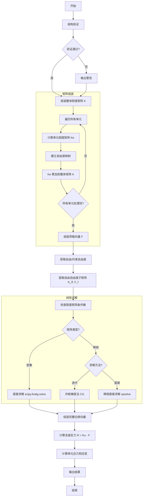

# 平面桁架结构有限元分析平台求解器实现分析

## 目录
1. [Newmark-β 法在动力分析中的实现](#1-newmark-β-法在动力分析中的实现)
2. [刚度矩阵的组装过程](#2-刚度矩阵的组装过程)
3. [边界条件的施加方式](#3-边界条件的施加方式)
4. [求解器计算流程图](#4-求解器计算流程图)
5. [数学公式与代码对应位置](#5-数学公式与代码对应位置)

---

## 1. Newmark-β 法在动力分析中的实现

### 1.1 基本原理

Newmark-β 法是一种逐步积分法，用于求解结构动力方程：

$$M\ddot{u} + C\dot{u} + Ku = F(t)$$

其中：
- $M$ 为质量矩阵
- $C$ 为阻尼矩阵
- $K$ 为刚度矩阵
- $F(t)$ 为荷载向量

### 1.2 算法实现步骤

#### 步骤1：参数初始化
- 默认参数（平均加速度法）：$\gamma = 0.5$, $\beta = 0.25$
- 该参数组合是无条件稳定的

**代码位置**：[dynamic.py:29-31](file:///Users/vance/project/mineProject/gsb/all/label/label-00206/0331-rl/fem_truss/solver/dynamic.py#L29-L31)

#### 步骤2：Rayleigh 阻尼构建

阻尼矩阵采用 Rayleigh 阻尼模型：
$$C = \alpha M + \beta K$$

通过两阶模态阻尼比求解系数：
$$\xi_i = \frac{\alpha}{2\omega_i} + \frac{\beta\omega_i}{2}$$

**代码位置**：[dynamic.py:49-74](file:///Users/vance/project/mineProject/gsb/all/label/label-00206/0331-rl/fem_truss/solver/dynamic.py#L49-L74)

#### 步骤3：积分系数计算

$$
\begin{align*}
a_0 &= \frac{1}{\beta \Delta t^2} \\
a_1 &= \frac{\gamma}{\beta \Delta t} \\
a_2 &= \frac{1}{\beta \Delta t} \\
a_3 &= \frac{1}{2\beta} - 1 \\
a_4 &= \frac{\gamma}{\beta} - 1 \\
a_5 &= \Delta t \left(\frac{\gamma}{2\beta} - 1\right) \\
a_6 &= \Delta t (1 - \gamma) \\
a_7 &= \gamma \Delta t
\end{align*}
$$

**代码位置**：[dynamic.py:183-191](file:///Users/vance/project/mineProject/gsb/all/label/label-00206/0331-rl/fem_truss/solver/dynamic.py#L183-L191)

#### 步骤4：有效刚度矩阵

$$K_{eff} = K + a_0 M + a_1 C$$

**代码位置**：[dynamic.py:194](file:///Users/vance/project/mineProject/gsb/all/label/label-00206/0331-rl/fem_truss/solver/dynamic.py#L194)

#### 步骤5：时间积分循环

对于每个时间步：
1. 计算有效荷载：
   $$F_{eff} = F(t) + M(a_0 u + a_2 \dot{u} + a_3 \ddot{u}) + C(a_1 u + a_4 \dot{u} + a_5 \ddot{u})$$

2. 求解位移：
   $$u_{new} = K_{eff}^{-1} F_{eff}$$

3. 更新加速度和速度：
   $$\ddot{u}_{new} = a_0 (u_{new} - u) - a_2 \dot{u} - a_3 \ddot{u}$$
   $$\dot{u}_{new} = \dot{u} + a_6 \ddot{u} + a_7 \ddot{u}_{new}$$

**代码位置**：[dynamic.py:197-219](file:///Users/vance/project/mineProject/gsb/all/label/label-00206/0331-rl/fem_truss/solver/dynamic.py#L197-L219)

---

## 2. 刚度矩阵的组装过程

### 2.1 单元刚度矩阵计算

对于每个桁架单元，首先计算局部坐标系下的刚度矩阵，然后通过坐标变换转换到整体坐标系：

$$k_{local} = \frac{EA}{L} \begin{bmatrix} 1 & -1 \\ -1 & 1 \end{bmatrix}$$

通过坐标变换矩阵 $T$ 转换到整体坐标系：
$$K_e = T^T k_{local} T$$

最终整体坐标系下的单元刚度矩阵：
$$K_e = \frac{EA}{L} \begin{bmatrix}
c^2 & cs & -c^2 & -cs \\
cs & s^2 & -cs & -s^2 \\
-c^2 & -cs & c^2 & cs \\
-cs & -s^2 & cs & s^2
\end{bmatrix}$$

其中 $c = \cos\theta$, $s = \sin\theta$

**代码位置**：[element.py:168-219](file:///Users/vance/project/mineProject/gsb/all/label/label-00206/0331-rl/fem_truss/core/element.py#L168-L219)

### 2.2 整体刚度矩阵组装流程

1. **初始化**：创建尺寸为 $ndof \times ndof$ 的零矩阵
2. **自由度映射**：建立单元局部自由度到整体自由度的映射关系
3. **单元循环**：遍历所有单元，计算单元刚度矩阵
4. **矩阵叠加**：将单元刚度矩阵的每个元素按自由度索引累加到整体刚度矩阵

支持两种存储模式：
- **密集矩阵**：使用 numpy.ndarray，适用于小规模问题（节点数 < 500）
- **稀疏矩阵**：使用 scipy.sparse.lil_matrix，适用于中大规模问题

**代码位置**：[structure.py:322-386](file:///Users/vance/project/mineProject/gsb/all/label/label-00206/0331-rl/fem_truss/core/structure.py#L322-L386)

---

## 3. 边界条件的施加方式

### 3.1 边界条件定义

边界条件采用节点约束的方式，每个节点可以独立约束 X 方向和 Y 方向的自由度。

**代码位置**：[structure.py:42-52](file:///Users/vance/project/mineProject/gsb/all/label/label-00206/0331-rl/fem_truss/core/structure.py#L42-L52)

### 3.2 自由度分类方法

本系统采用**子矩阵法**施加边界条件：

1. **自由度分类**：将所有自由度分为自由自由度 (free_dofs) 和约束自由度 (constrained_dofs)
2. **矩阵缩聚**：提取自由自由度对应的子矩阵 $K_{ff}$
3. **求解缩减系统**：$K_{ff} u_f = F_f$
4. **位移回填**：将求得的自由位移回填到完整位移向量，约束自由度位移为 0

### 3.3 具体实现步骤

1. 收集所有被约束的自由度索引
2. 通过集合运算得到自由自由度索引
3. 使用 `np.ix_` 提取自由自由度的子矩阵
4. 求解缩减后的线性方程组
5. 组装完整的位移向量

**代码位置**：[structure.py:468-484](file:///Users/vance/project/mineProject/gsb/all/label/label-00206/0331-rl/fem_truss/core/structure.py#L468-L484)
**代码位置**：[static.py:77-123](file:///Users/vance/project/mineProject/gsb/all/label/label-00206/0331-rl/fem_truss/solver/static.py#L77-L123)

---

## 4. 求解器计算流程图

---

## 5. 数学公式与代码对应位置

### 5.1 静力分析核心公式

| 公式编号 | 数学公式 | 代码位置 | 说明 |
|---------|---------|---------|------|
| 5.1.1 | $K_e = \frac{EA}{L} T^T \begin{bmatrix} 1 & -1 \\ -1 & 1 \end{bmatrix} T$ | [element.py:212-217](file:///Users/vance/project/mineProject/gsb/all/label/label-00206/0331-rl/fem_truss/core/element.py#L212-L217) | 单元刚度矩阵 |
| 5.1.2 | $K_{gi,gj} += K_{e,i,j}$ | [structure.py:344-346](file:///Users/vance/project/mineProject/gsb/all/label/label-00206/0331-rl/fem_truss/core/structure.py#L344-L346) | 刚度矩阵组装 |
| 5.1.3 | $K_{ff} u_f = F_f$ | [static.py:85-117](file:///Users/vance/project/mineProject/gsb/all/label/label-00206/0331-rl/fem_truss/solver/static.py#L85-L117) | 边界条件处理与求解 |
| 5.1.4 | $R = K u - F$ | [static.py:128-131](file:///Users/vance/project/mineProject/gsb/all/label/label-00206/0331-rl/fem_truss/solver/static.py#L128-L131) | 支座反力计算 |
| 5.1.5 | $\varepsilon = B u$ | [element.py:146](file:///Users/vance/project/mineProject/gsb/all/label/label-00206/0331-rl/fem_truss/core/element.py#L146) | 应变计算 |
| 5.1.6 | $\sigma = E \varepsilon$ | [element.py:285-286](file:///Users/vance/project/mineProject/gsb/all/label/label-00206/0331-rl/fem_truss/core/element.py#L285-L286) | 应力计算 |
| 5.1.7 | $U = \frac{1}{2} u^T K u$ | [static.py:185](file:///Users/vance/project/mineProject/gsb/all/label/label-00206/0331-rl/fem_truss/solver/static.py#L185) | 应变能计算 |

### 5.2 动力分析核心公式

| 公式编号 | 数学公式 | 代码位置 | 说明 |
|---------|---------|---------|------|
| 5.2.1 | $M \ddot{u} + C \dot{u} + K u = F(t)$ | [dynamic.py:171](file:///Users/vance/project/mineProject/gsb/all/label/label-00206/0331-rl/fem_truss/solver/dynamic.py#L171) | 动力平衡方程 |
| 5.2.2 | $C = \alpha M + \beta K$ | [dynamic.py:113](file:///Users/vance/project/mineProject/gsb/all/label/label-00206/0331-rl/fem_truss/solver/dynamic.py#L113) | Rayleigh 阻尼 |
| 5.2.3 | $\xi_i = \frac{\alpha}{2\omega_i} + \frac{\beta\omega_i}{2}$ | [dynamic.py:62](file:///Users/vance/project/mineProject/gsb/all/label/label-00206/0331-rl/fem_truss/solver/dynamic.py#L62) | 阻尼比公式 |
| 5.2.4 | $K_{eff} = K + a_0 M + a_1 C$ | [dynamic.py:194](file:///Users/vance/project/mineProject/gsb/all/label/label-00206/0331-rl/fem_truss/solver/dynamic.py#L194) | 有效刚度矩阵 |
| 5.2.5 | $F_{eff} = F(t) + M(a_0 u + a_2 \dot{u} + a_3 \ddot{u}) + C(a_1 u + a_4 \dot{u} + a_5 \ddot{u})$ | [dynamic.py:203-204](file:///Users/vance/project/mineProject/gsb/all/label/label-00206/0331-rl/fem_truss/solver/dynamic.py#L203-L204) | 有效荷载向量 |
| 5.2.6 | $\ddot{u}_{new} = a_0 (u_{new} - u) - a_2 \dot{u} - a_3 \ddot{u}$ | [dynamic.py:210](file:///Users/vance/project/mineProject/gsb/all/label/label-00206/0331-rl/fem_truss/solver/dynamic.py#L210) | 加速度更新 |
| 5.2.7 | $\dot{u}_{new} = \dot{u} + a_6 \ddot{u} + a_7 \ddot{u}_{new}$ | [dynamic.py:211](file:///Users/vance/project/mineProject/gsb/all/label/label-00206/0331-rl/fem_truss/solver/dynamic.py#L211) | 速度更新 |
| 5.2.8 | $K \phi_i = \omega_i^2 M \phi_i$ | [static.py:212](file:///Users/vance/project/mineProject/gsb/all/label/label-00206/0331-rl/fem_truss/solver/static.py#L212) | 广义特征值问题 |
| 5.2.9 | $f_i = \frac{\omega_i}{2\pi}$ | [static.py:216](file:///Users/vance/project/mineProject/gsb/all/label/label-00206/0331-rl/fem_truss/solver/static.py#L216) | 固有频率计算 |

### 5.3 积分系数公式

| 公式编号 | 数学公式 | 代码位置 |
|---------|---------|---------|
| 5.3.1 | $a_0 = \frac{1}{\beta \Delta t^2}$ | [dynamic.py:184](file:///Users/vance/project/mineProject/gsb/all/label/label-00206/0331-rl/fem_truss/solver/dynamic.py#L184) |
| 5.3.2 | $a_1 = \frac{\gamma}{\beta \Delta t}$ | [dynamic.py:185](file:///Users/vance/project/mineProject/gsb/all/label/label-00206/0331-rl/fem_truss/solver/dynamic.py#L185) |
| 5.3.3 | $a_2 = \frac{1}{\beta \Delta t}$ | [dynamic.py:186](file:///Users/vance/project/mineProject/gsb/all/label/label-00206/0331-rl/fem_truss/solver/dynamic.py#L186) |
| 5.3.4 | $a_3 = \frac{1}{2\beta} - 1$ | [dynamic.py:187](file:///Users/vance/project/mineProject/gsb/all/label/label-00206/0331-rl/fem_truss/solver/dynamic.py#L187) |
| 5.3.5 | $a_4 = \frac{\gamma}{\beta} - 1$ | [dynamic.py:188](file:///Users/vance/project/mineProject/gsb/all/label/label-00206/0331-rl/fem_truss/solver/dynamic.py#L188) |
| 5.3.6 | $a_5 = \Delta t \left(\frac{\gamma}{2\beta} - 1\right)$ | [dynamic.py:189](file:///Users/vance/project/mineProject/gsb/all/label/label-00206/0331-rl/fem_truss/solver/dynamic.py#L189) |
| 5.3.7 | $a_6 = \Delta t (1 - \gamma)$ | [dynamic.py:190](file:///Users/vance/project/mineProject/gsb/all/label/label-00206/0331-rl/fem_truss/solver/dynamic.py#L190) |
| 5.3.8 | $a_7 = \gamma \Delta t$ | [dynamic.py:191](file:///Users/vance/project/mineProject/gsb/all/label/label-00206/0331-rl/fem_truss/solver/dynamic.py#L191) |

---

## 总结

本求解器系统具有以下特点：

1. **数值稳定性**：Newmark-β 法采用平均加速度法参数（γ=0.5, β=0.25），无条件稳定
2. **高效性**：支持稀疏矩阵存储和迭代求解器，适用于大规模问题
3. **模块化设计**：结构、单元、求解器分离，易于扩展
4. **鲁棒性**：包含条件数检查、病态矩阵检测等数值稳定性措施
